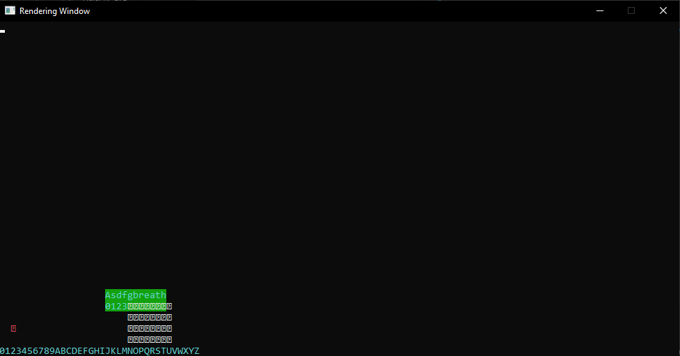

Zombie Unicode Renderer
===
A simple rendering manager for Windows terminals.
---
This tool is windows-only as it depends upon the C++ Win32 API.
It is intended to be used raw in a project to speed up the use of the Win32 API. I created this tool for myself. I won't be offering further support for this tool.

### Install on Windows
* [Install 7-Zip](https://7-zip.org/download.html).
* Install GCC. In the directory `C:\`, download and unzip [MinGW x86_64-XX.X.X-release-win32-seh-msvcrt-rt_vXX-revX.7z](https://github.com/niXman/mingw-builds-binaries/releases); the location of `g++.exe` should be `C:\mingw64\bin\g++.exe`.
* Add `C:\mingw64\bin` to the Windows Environment Variable [PATH](https://www.computerhope.com/issues/ch000549.htm).
* [Install Git Bash](https://git-scm.com/download/win); make sure to choose "Run Git from the Windows Command Prompt" during installation. This should result in a MINGW64 Bash installation that can access your Windows PATH while having access to Linux commands (ie. the `find` command).
* [Clone this repository](https://docs.github.com/en/repositories/creating-and-managing-repositories/cloning-a-repository#cloning-a-repository) to a directory on your computer. That directory will be referred to as `root`.
* Install [Make for Windows](https://gnuwin32.sourceforge.net/packages/make.htm); the location of `make.exe` should be `C:\Program Files (x86)\GnuWin32\bin\make.exe`.
* Add `C:\Program Files (x86)\GnuWin32\bin\` to the Windows Environment Variable [PATH](https://www.computerhope.com/issues/ch000549.htm).

From here, everything should be installed to compile & run this software.

### Compile & Run Scripts
To run a script, open a Bash (or equivalent) terminal within `root` and type the command.

| command | description |
|:----------- |:----------- |
| `make` | compile & link the program |
| `make clean` | remove all compiled files |

### Contribute
Unfortunately, this project doesn't support community contributions right now. Feel free to fork, but be sure to read the license.
